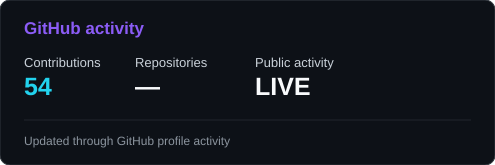
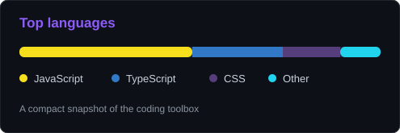
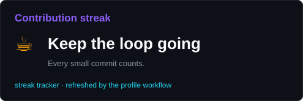
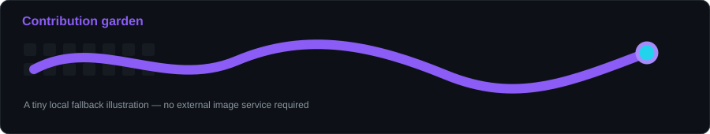
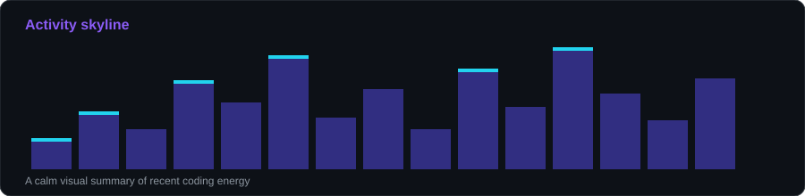

# `suxinghang`'s coding dashboard

small commits · curious experiments · one contribution at a time

 
 

 

## ☕ Today at the keyboard

 

## 🐍 Contribution garden

## 🏙️ Activity skyline

 

made with markdown, caffeine, and a suspicious number of tabs open

