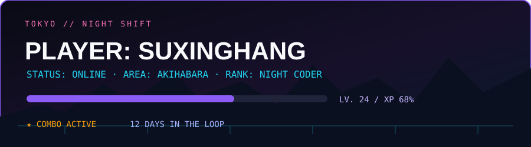
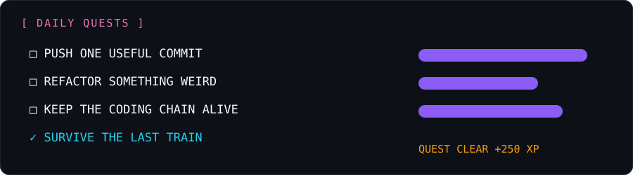
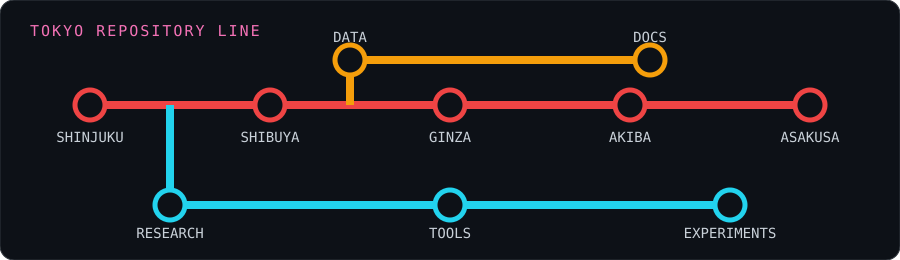
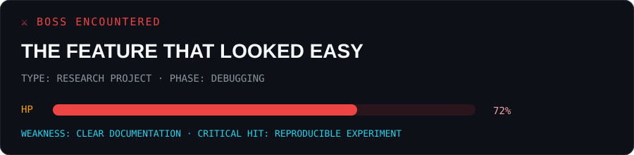
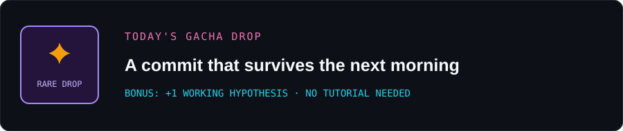

 

駅は終わっても、コードは終わらない。 The city sleeps. The commits don't.

## 🎮 Daily quest board

> Make something slightly less broken than yesterday.

## 🚇 Tokyo repository line

> NEXT STATION: BETTER VERSION · TRANSFER AT: REFACTORING

## 👾 Contribution arcade

> One more commit before the last train.

## ⚔️ Boss battle

> BOSS PHASE 2: Why does this work on my machine?

## 🎰 Today's drop

 

Built between the last train and the next idea. 眠い。でも、あと一個だけ。

